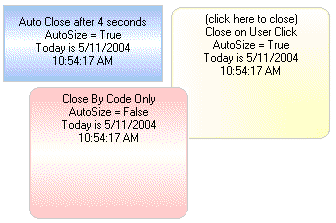



## Alert Window

### Description

(Update 5/11/04 - added another display type) This is an alert window that rises up from the taskbar or fades in/out. I had no intentions of posting this but after seeing Todd Tanner's MSN style alert window, and having my comments deleted, I decided to post it for education purposes only. NO VOTING PLEASE but comments are welcome. (Update 4/7/04 - Added options for border style, background color, and Close by code only.)
 
### More Info
 

             |
---                |---
**Submitted On**   |2004-05-11 11:12:08
**By**             |[Morgan Haueisen](https://github.com/Planet-Source-Code/PSCIndex/blob/master/ByAuthor/morgan-haueisen.md)
**Level**          |Advanced
**User Rating**    |4.8 (269 globes from 56 users)
**Compatibility**  |VB 6\.0
**Category**       |[VB function enhancement](https://github.com/Planet-Source-Code/PSCIndex/blob/master/ByCategory/vb-function-enhancement__1-25.md)
**World**          |[Visual Basic](https://github.com/Planet-Source-Code/PSCIndex/blob/master/ByWorld/visual-basic.md)
**Archive File**   |[Alert\_Wind1744095112004\.zip](https://github.com/Planet-Source-Code/morgan-haueisen-alert-window__1-52793/archive/master.zip)

